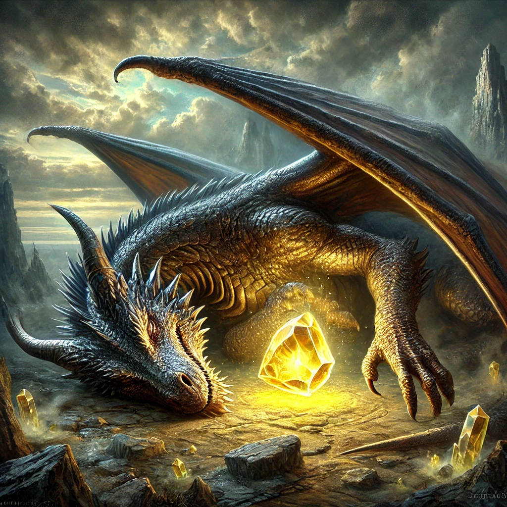

### Campaign Overview: "The Dragonborn Chronicles: Quest for the Heartstone"

#### Setting:
The campaign is set in the vibrant and magical land of Draconia, a realm where Dragonborn of all colors and creeds live in harmony. The land is filled with lush forests, towering mountains, and ancient ruins. Magic is a natural part of life, and the Dragonborn are known for their wisdom, strength, and sense of community.

#### Characters:
1. **Thalor Brightscale** - A young, golden Dragonborn Paladin with a heart of gold. Thalor is on a quest to prove his bravery and protect the innocent. He is the son of a renowned knight and dreams of living up to his father's legacy.
   
2. **Zara Emberclaw** - A fiery red Dragonborn Sorceress with a mischievous streak. Zara is a talented spellcaster who loves to explore ancient ruins and uncover hidden secrets. She is the daughter of a famous archaeologist and has a knack for getting into trouble.

3. **Borin Stonefist** - A sturdy, silver Dragonborn Fighter with a strong sense of justice. Borin is a blacksmith's apprentice who dreams of becoming a legendary warrior. He is known for his unwavering loyalty and determination.

4. **Lina Moonshadow** - A graceful, blue Dragonborn Druid with a deep connection to nature. Lina is a healer and protector of the forests. She is the daughter of the village healer and has a gentle, nurturing spirit.

#### Interwoven Stories:
The characters all come from the same village, Drakenshire, and have grown up together. They share a deep bond of friendship and trust, having faced many small adventures together as children. Each character has a personal quest that ties into the main story, and their paths naturally converge as they work together to achieve their goals.

#### Main Story:
The Heartstone, a powerful artifact that maintains the balance of magic in Draconia, has been stolen by a mysterious dark force. The village elders have chosen the young heroes to embark on a quest to retrieve the Heartstone and restore harmony to the land. Along the way, they will face challenges that test their courage, wisdom, and friendship.

#### The Call:
As the festival reaches its peak, the village elder, Elder Drakon, gathers everyone for an important announcement. He reveals that the Heartstone has been stolen, and the balance of magic in Draconia is at risk. The elder believes that the young heroes are destined to retrieve the Heartstone and save the land.

#### The Quest Begins:
The players are given a map and a few supplies for their journey. They set out on their quest, filled with excitement and determination. Along the way, they encounter their first challenge: a mischievous group of forest sprites who have stolen their map. The players must use their wits and teamwork to retrieve the map and continue their journey.

### Backstory of the Heartstone

#### The Origin of the Heartstone:
Long ago, in the ancient times of Draconia, the land was a chaotic place where magic ran wild and untamed. The Dragonborn tribes were constantly at odds, and the natural world was in turmoil. It was during this time that the great Dragon Sage, Eldara the Wise, emerged. Eldara was a powerful and benevolent dragon who sought to bring peace and harmony to the land.

Eldara embarked on a quest to find a way to balance the chaotic magic and unite the Dragonborn tribes. After years of searching and countless trials, she discovered a hidden valley where the very essence of magic converged. In the heart of this valley, she found a magnificent crystal pulsating with pure, harmonious energy. Eldara named this crystal the Heartstone.

Using her immense power, Eldara infused the Heartstone with her own life force, creating a powerful artifact that could regulate the flow of magic throughout Draconia. The Heartstone became the cornerstone of the land's stability, ensuring that magic was balanced and that the Dragonborn could live in harmony with each other and with nature.

#### The Significance of the Heartstone:
The Heartstone is more than just a magical artifact; it is the very heart of Draconia. It maintains the balance of magic, ensuring that the land remains fertile, the weather remains stable, and the natural world thrives. Without the Heartstone, the magic of Draconia would become wild and uncontrollable, leading to chaos and destruction.

The Heartstone is also a symbol of unity and peace among the Dragonborn tribes. It serves as a reminder of Eldara's sacrifice and the importance of working together for the greater good. The Heartstone is kept in a sacred temple in the village of Drakenshire, where it is protected and revered by the villagers.

#### The Dragon Festival:
The Dragon Festival is an annual celebration held in Drakenshire to honor the memory of Eldara the Wise and the creation of the Heartstone. It is a time of joy, unity, and reflection, where the Dragonborn come together to celebrate their shared heritage and the harmony that the Heartstone brings to their land.

During the festival, the villagers participate in various activities that symbolize the values of courage, wisdom, and community. These activities include:

1. **The Strength Contest** - A competition that celebrates the physical prowess and bravery of the Dragonborn, reminding them of Eldara's strength and determination.
2. **The Magic Show** - A display of magical talents that honors the harmonious magic of the Heartstone and the importance of using magic responsibly.
3. **The Nature Walk** - A guided walk through the forest that emphasizes the connection between the Dragonborn and the natural world, reflecting Eldara's love for nature.

The highlight of the festival is the **Heartstone Ceremony**, where the village elder, Elder Drakon, leads a ritual to renew the bond between the Heartstone and the land. The villagers gather around the Heartstone, offering their prayers and gratitude for the peace and prosperity it brings.

#### Connection to the Campaign:
The theft of the Heartstone during the Dragon Festival is a devastating blow to the village of Drakenshire and the entire land of Draconia. The festival, which is usually a time of joy and celebration, becomes a call to action for the young heroes. They are chosen to embark on a quest to retrieve the Heartstone and restore balance to their world.

As the players journey through Draconia, they will encounter various challenges and learn valuable lessons that reflect the values celebrated during the Dragon Festival. Their quest to recover the Heartstone is not just about restoring magic; it is about upholding the legacy of Eldara the Wise and ensuring that the spirit of unity and harmony continues to thrive in their land.

### Antagonist: Valthor Shadowclaw

#### Backstory:
Valthor Shadowclaw is a dark-scaled Dragonborn who once lived in Drakenshire. As a young Dragonborn, Valthor was a promising student of magic, showing great potential and a deep curiosity about the ancient secrets of Draconia. However, his thirst for knowledge and power led him down a darker path. Valthor believed that the Heartstone's power was being wasted by simply maintaining balance and that it could be used to achieve greater things, such as unlocking forbidden magics and gaining ultimate control over the land.

Valthor's radical ideas and experiments eventually led to his exile from Drakenshire. He wandered the land, growing more bitter and resentful towards those who had cast him out. Over time, he gathered a group of like-minded individuals who shared his vision of harnessing the Heartstone's power for their own purposes. Valthor's ultimate goal is to use the Heartstone to reshape Draconia according to his own vision, believing that he can create a better world, even if it means causing temporary chaos and suffering.

#### Motivations:
Valthor is not purely evil; he genuinely believes that his actions will lead to a better future for Draconia. He sees the current balance maintained by the Heartstone as a stagnation, preventing progress and the true potential of magic from being realized. Valthor's drive comes from a place of ambition and a desire to prove himself, as well as a deep-seated need to be recognized and respected by those who once shunned him.

### Resolving the Heartstone Crisis:
The players must use everything they've learned and work together to restore balance to Draconia. The campaign culminates in a confrontation but offers multiple paths for resolving the crisis, allowing the players to choose their approach:

1. **Confrontation**:
   - The players can choose to confront Valthor and his followers directly, engaging in battles and using their skills to defeat them. This path emphasizes bravery and strength.

2. **Diplomacy**:
   - The players can attempt to negotiate with Valthor, appealing to his better nature and trying to convince him to return the Heartstone. This path focuses on empathy, persuasion, and understanding.

3. **Redemption**:
   - The players can seek to understand Valthor's motivations and find a way to address his grievances. They might work to find a compromise that allows Valthor to achieve his goals without causing harm. This path highlights forgiveness, redemption, and the power of unity.

4. **Alternative Solutions**:
   - The players can explore alternative solutions, such as finding a way to create a new Heartstone or discovering ancient magic that can restore balance without the original artifact. This path encourages creativity and innovation.

By offering multiple paths and emphasizing moral lessons, the campaign ensures that players of all ages can engage with the story in meaningful ways, learning valuable lessons about courage, perseverance, and the importance of working together for the greater good. If successful, the campaign ends with a grand celebration in Drakenshire, where the players are hailed as heroes.
